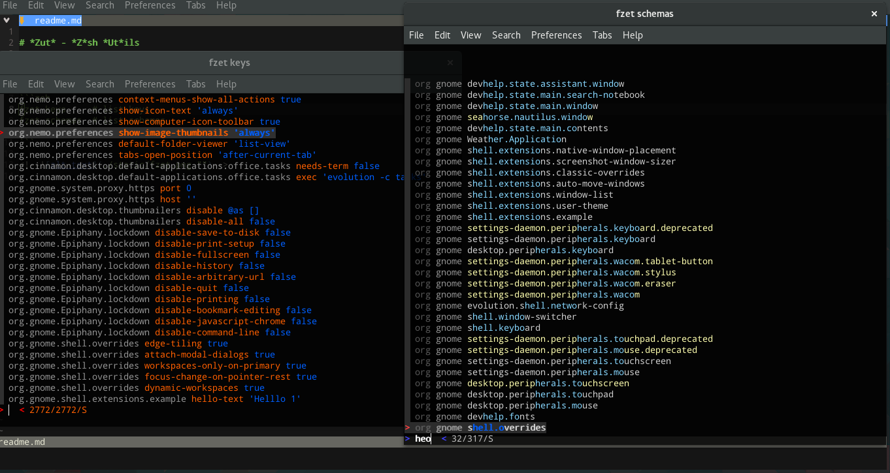

# *Zut* - *Z*sh *Ut*ils
=======================

### fzet
`gsettings` viewing through <a href="github.com/junegunn/fzf">fzf</a>
```zsh
fzet keys     # list keys
fzet schemas  # list schemas
fzet list     # list both, pretty-mode
```



